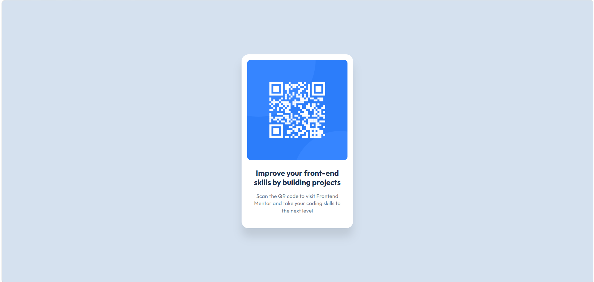

# Frontend Mentor - QR code component solution

This is a solution to the [QR code component challenge on Frontend Mentor](https://www.frontendmentor.io/challenges/qr-code-component-iux_sIO_H). Frontend Mentor challenges help you improve your coding skills by building realistic projects. 

## Table of contents

- [Overview](#overview)
  - [Screenshot](#screenshot)
  - [Links](#links)
- [My process](#my-process)
  - [Built with](#built-with)
  - [What I learned](#what-i-learned)
  - [Continued development](#continued-development)
  - [Useful resources](#useful-resources)
  - [AI Collaboration](#ai-collaboration)
- [Author](#author)

**Note: Delete this note and update the table of contents based on what sections you keep.**

## Overview

### Screenshot

### Links

- Solution URL: [Add solution URL here](https://github.com/EasonQi777/qr-code-)
- Live Site URL: [Add live site URL here](none)

## My process

### Built with

- Semantic HTML5 markup
- CSS custom properties
- Flexbox
- CSS Grid

### What I learned

learned basic knowledge about layout

### Continued development

- tailwind CSS

- more design

### Useful resources

### AI Collaboration

Describe how you used AI tools (if any) during this project. This helps demonstrate your ability to work effectively with AI assistants.

- What tools did you use (e.g., ChatGPT, Claude, GitHub Copilot)?
 
  cursor agent

- How did you use them (e.g., debugging, generating boilerplate, brainstorming solutions)?

  brainstorming solutions

- What worked well? What didn't?

  I can't describe questions well, so sometimes become complex

## Author

- Website - [Eason](https://github.com/EasonQi777/qr-code-)
- Frontend Mentor - [@yourusername](https://www.frontendmentor.io/profile/EasonQi777)

